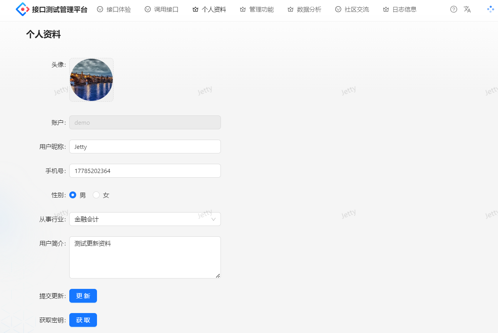
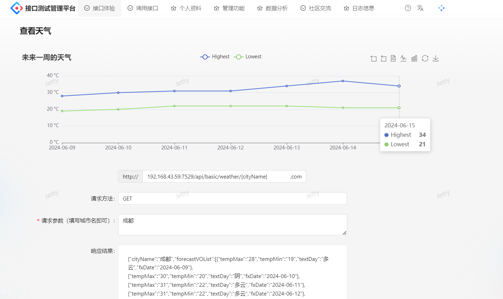
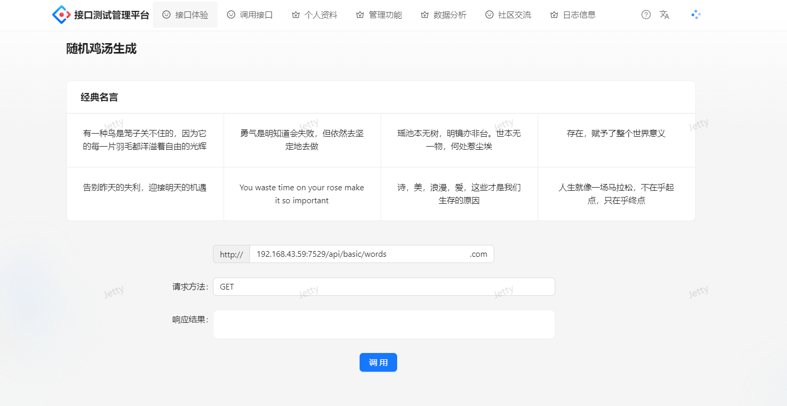
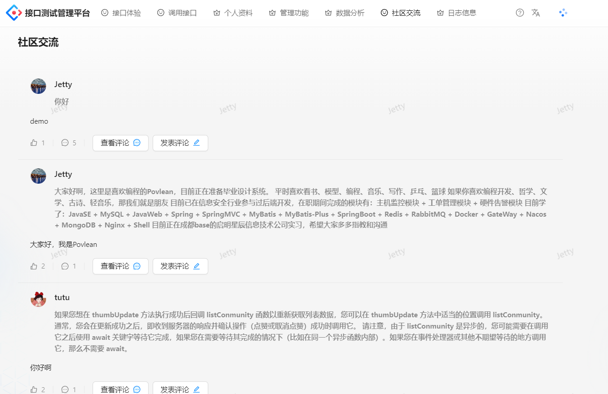
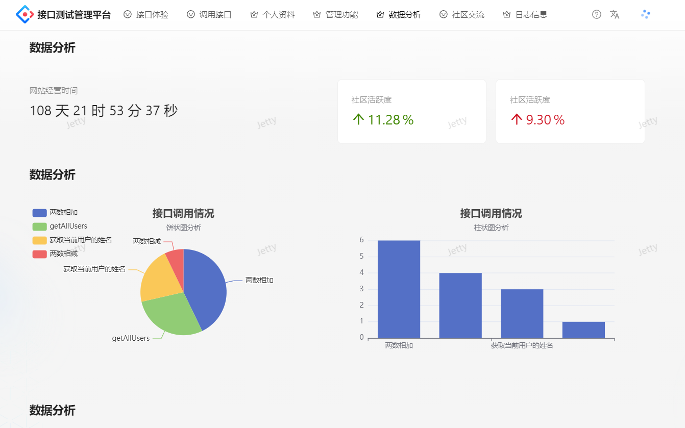
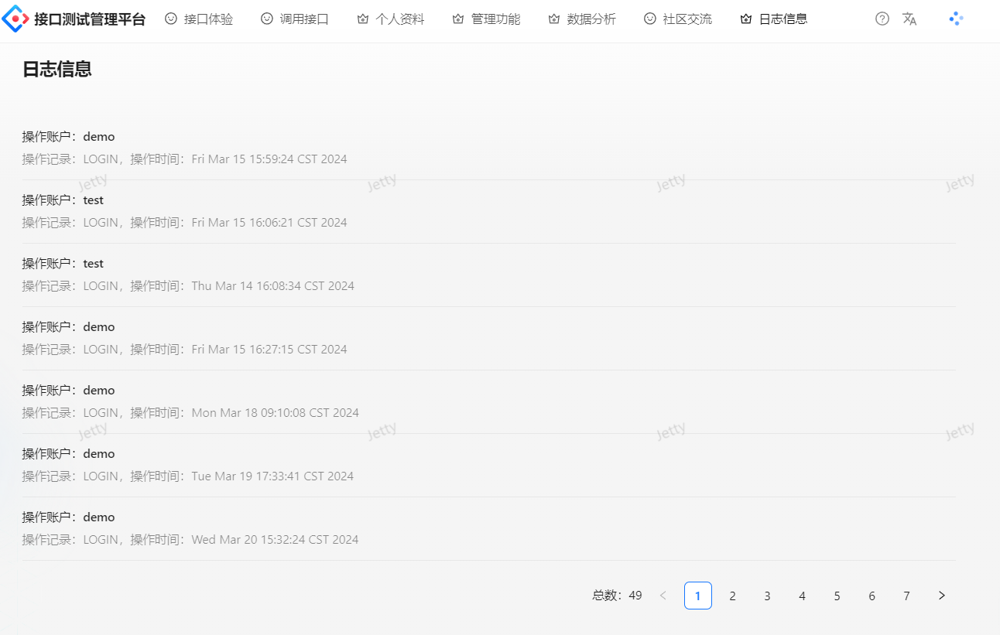
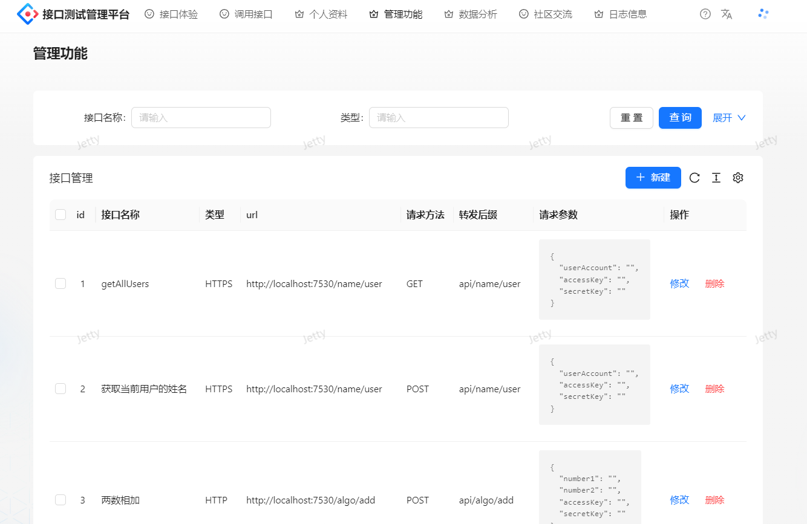

# Povl-Api
### 项目介绍

Povl-Api项目是用于集成第三方API和支持接口管理的平台，该项目仅用于学习，不能用于商用。
Povl-Api是本人的毕业设计项目，该项目不是一个很好的第三方开放平台，有许多可以优化的地方。
比如并未实现本地测试的功能、管理接口和发布接口并不完善、并不像市面上的ApiFox那样灵活。
该项目仅作为毕设项目，由于当时答辩的时间紧，任务重，所以有很多缺点，功能并不是很完善，但作为毕设项目已经足够了。

### 技术介绍

使用到的技术栈 Spring Boot + MySQL + Mybatis + Redis + Dubbo + Gateway + Ant Design Pro + Axios + TS
Povl-Api项目目前用于熟悉SpringCloud微服务组件，以及分布式架构。

前端初始化项目 Povlapi-frontend

后端初始化项目 Povlapi-backend

该PovlApi项目是本人毕业设计使用的项目，用于学习交流。

### 本地环境

要运行该项目，需要本地下载Nacos 2.2.0软件

进入到软件的 bin 目录下，使用命令 startup.cmd -m standalone 命令运行单机nacos

### 效果展示

主页面：

个人页面：

天气API：

新闻API：

头像API：

鸡汤API：

社区功能：

数据分析：

登录日志：

接口管理：

