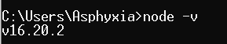

# Povl-Api
Povl-Api项目目前用于熟悉SpringCloud微服务组件，以及分布式架构。
使用到的技术栈
Spring Boot + MySQL + Mybatis + Redis + Dubbo + Gateway + Ant Design Pro + Axios + TS
Povl-Api项目目前用于熟悉SpringCloud微服务组件，以及分布式架构。 使用到的技术栈 Spring Boot + MySQL + Mybatis + Redis + Dubbo + Gateway + Ant Design Pro + Axios + TS

前端初始化项目 Povlapi-frontend 后端初始化项目 Povlapi-backend

该PovlApi项目是本人毕业设计使用的项目，用于学习交流。

-----------------------------效果展示-------------------------------------------
1.node 版本：

2.nacos 版本：

3.主页面：

4.天气API：

5.新闻API：

6.头像API：

7.鸡汤API：

8.社区功能：

9.数据分析：

10.登录日志：

11.接口管理：

